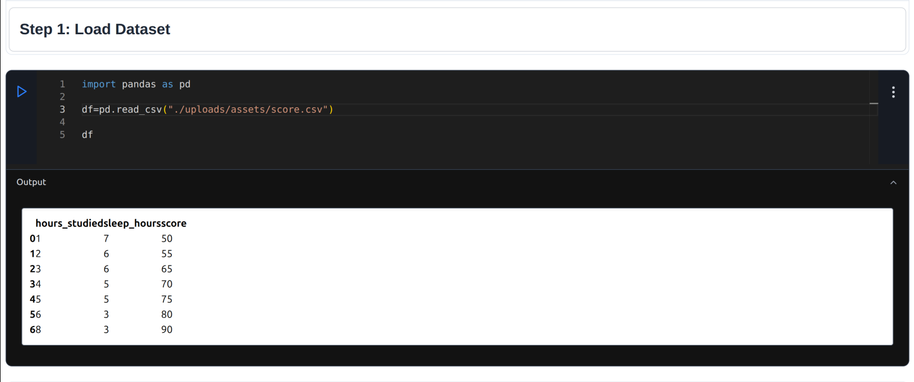
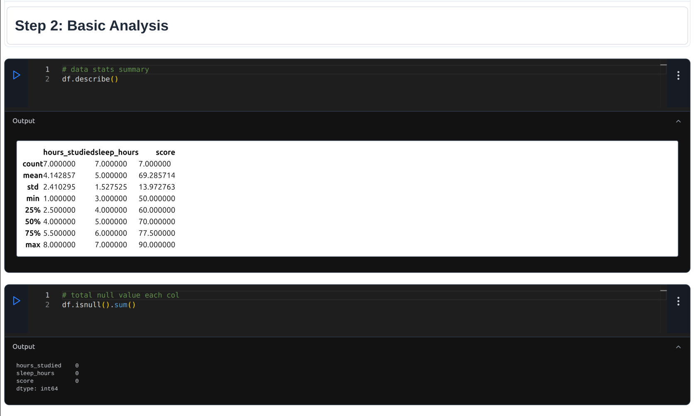
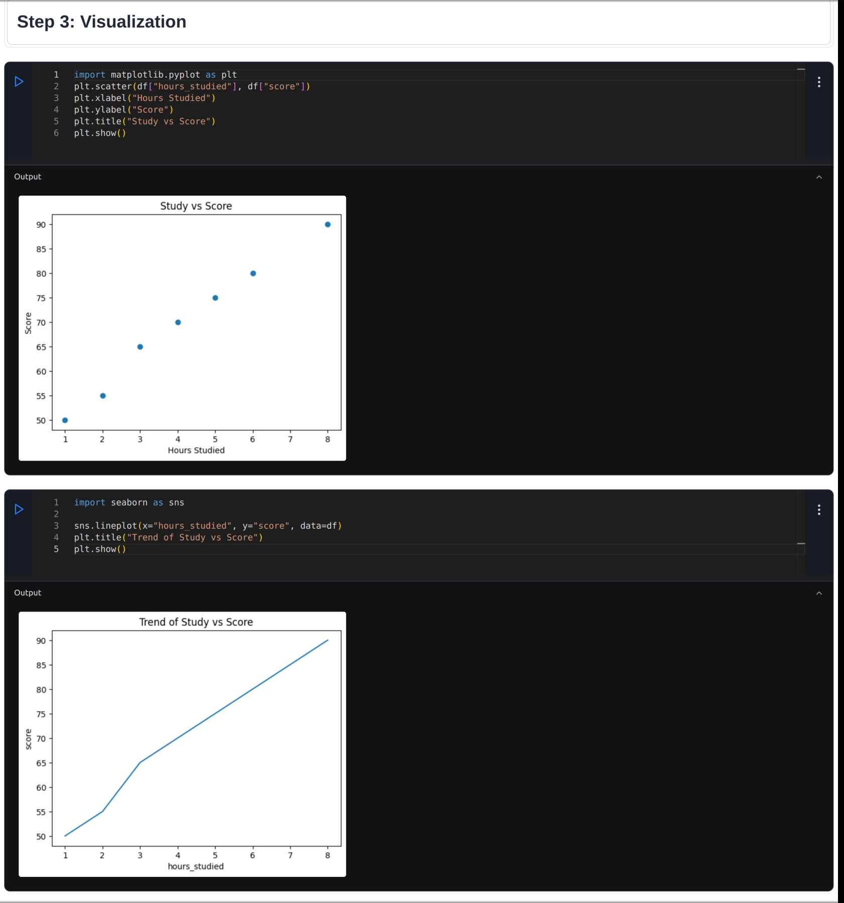
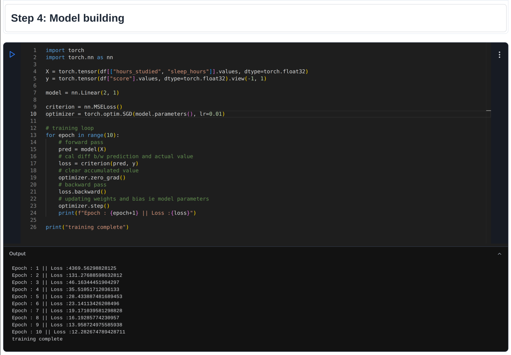
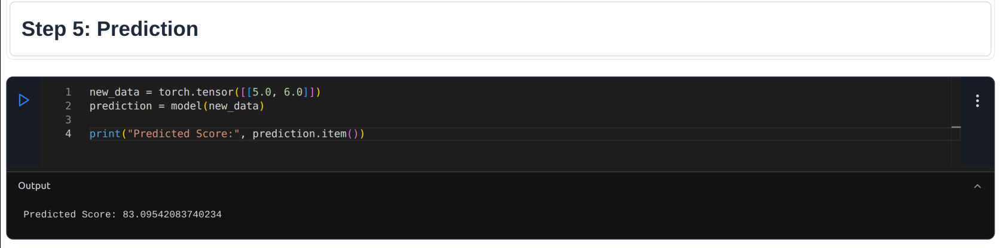
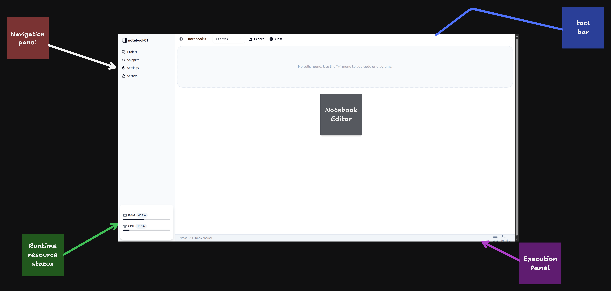
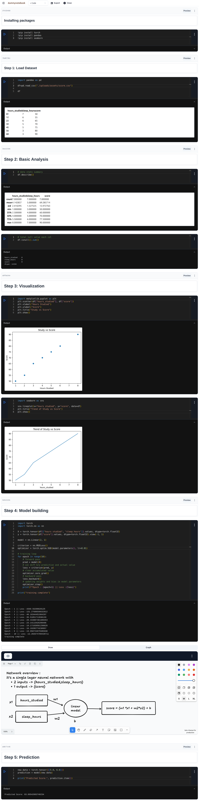

# Draftly Notebook

> Run Python notebooks with real-time execution inside Docker containers.

---

## What is this?

This project is a simple notebook platform inspired by Google Colab.

You can:

* Create notebooks
* Write Python code in cells
* Execute code
* See output instantly
* Save your work

All code runs inside Docker containers for isolation.

---

## Demo: Data Analysis + Machine Learning

This demo shows how the draftly notebook can be used in a simple data science workflow.

We use a small dataset to:

* Explore data (EDA)
* Visualize patterns
* Train a basic model using PyTorch
* Generate insights

---

## Step 1: Load Dataset

We load a dataset using pandas and display it.



---

## Step 2: Basic Analysis (EDA)

We perform basic statistical analysis and check for missing values.



---

## Step 3: Visualization

We visualize relationships in the data using matplotlib and seaborn.



---

## Step 4: Model Training 

We train a simple linear model using PyTorch.



---

## Step 5: Prediction

We use the trained model to make predictions.



---

## Insights

* Students who study more tend to score higher
* Sleep also impacts performance
* The model learns a simple relationship between study, sleep, and score

---

## How it works

1. User writes code in the browser
2. Code is sent to the backend
3. Backend runs the code inside a Docker container
4. Output is returned and displayed

---

## Features

* User authentication
* Notebook creation
* Code execution in cells
* Output display
* Storing Snippets,secrets
* Docker-based isolation
* Notebook saving

---

## Tech Stack

Frontend:

* React
* Monaco Editor
* Tldraw
* Tiptap
* React Flow
* Clerk (Authentication and Authorization)

Backend:

* Python (FastAPI)

Execution:

* Docker containers

---

## Challenges I faced

* Managing Docker containers dynamically
* Keeping notebook state across cells
* Handling execution errors properly

---

## Security

All code runs inside isolated Docker containers.
This prevents direct access to the host system.

---

## How to run

### 1. Clone repository

```bash
git clone https://github.com/Fluffy-debuger/Draftly.git
cd Draftly
```

### 2. Backend setup

```bash
cd notebook_server

python3 -m venv .pyenv
source .pyenv/bin/activate

pip install -r requirements.txt

uvicorn main:app --reload
uvicorn RT_server:app --port 8082 --reload
```

### 3. Frontend setup

```bash
cd notebook_UI

npm install
npm run dev
```

### 4. Build execution container

```bash
cd notebook_server

docker build -f dockertemplate -t executionserver .
```

---

## Complete Notebook Overview

---


---

## Future Improvements

- Improved user interface and experience  
- Terminal and shell support (using xterm.js)  
- Kernel persistence across sessions  
- Resource limits for container execution  
- Support for web preview inside notebooks  
- Drag and drop cells for better interaction  
- Runtime flexibility (local, Docker, and remote/cloud execution)  
- Storage integration (Google Drive, OneDrive)  

---
